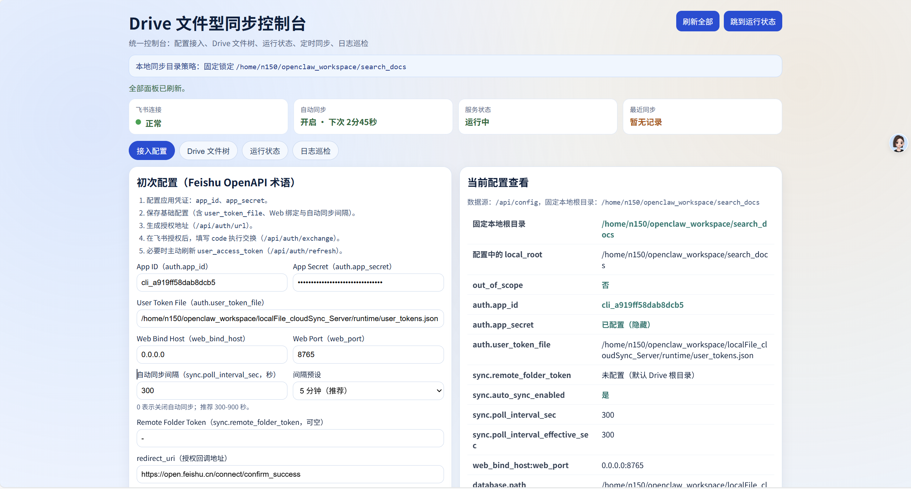
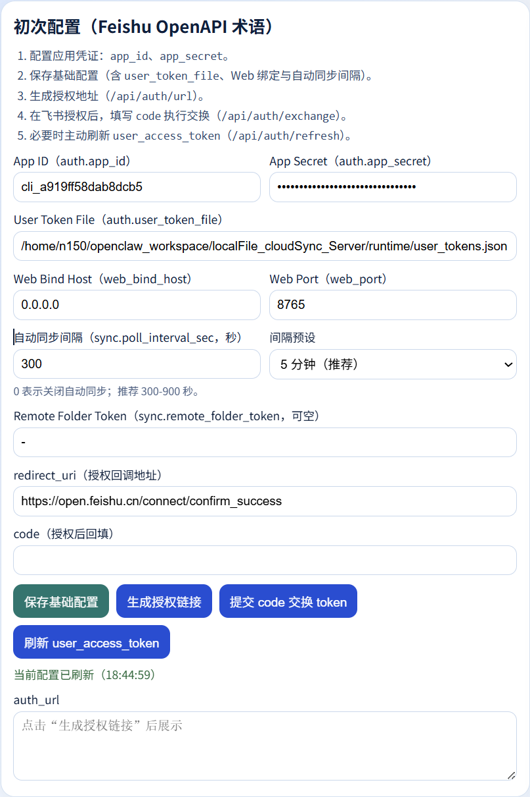
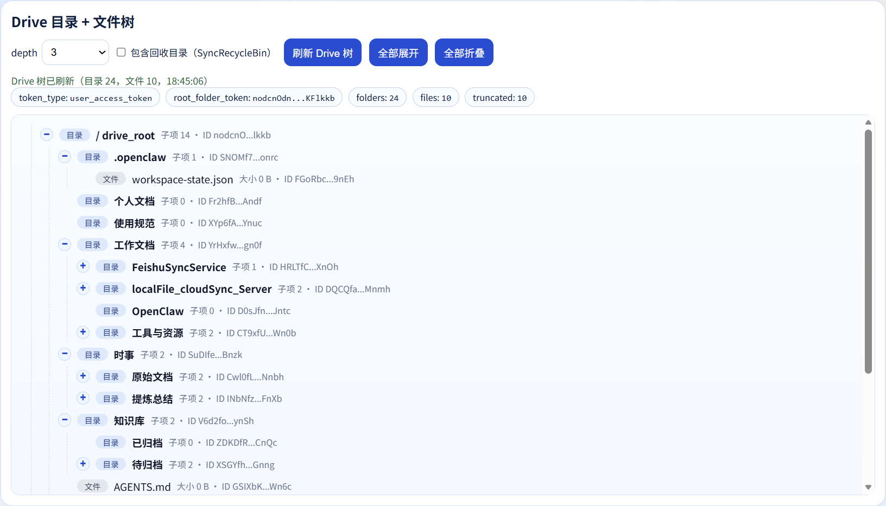
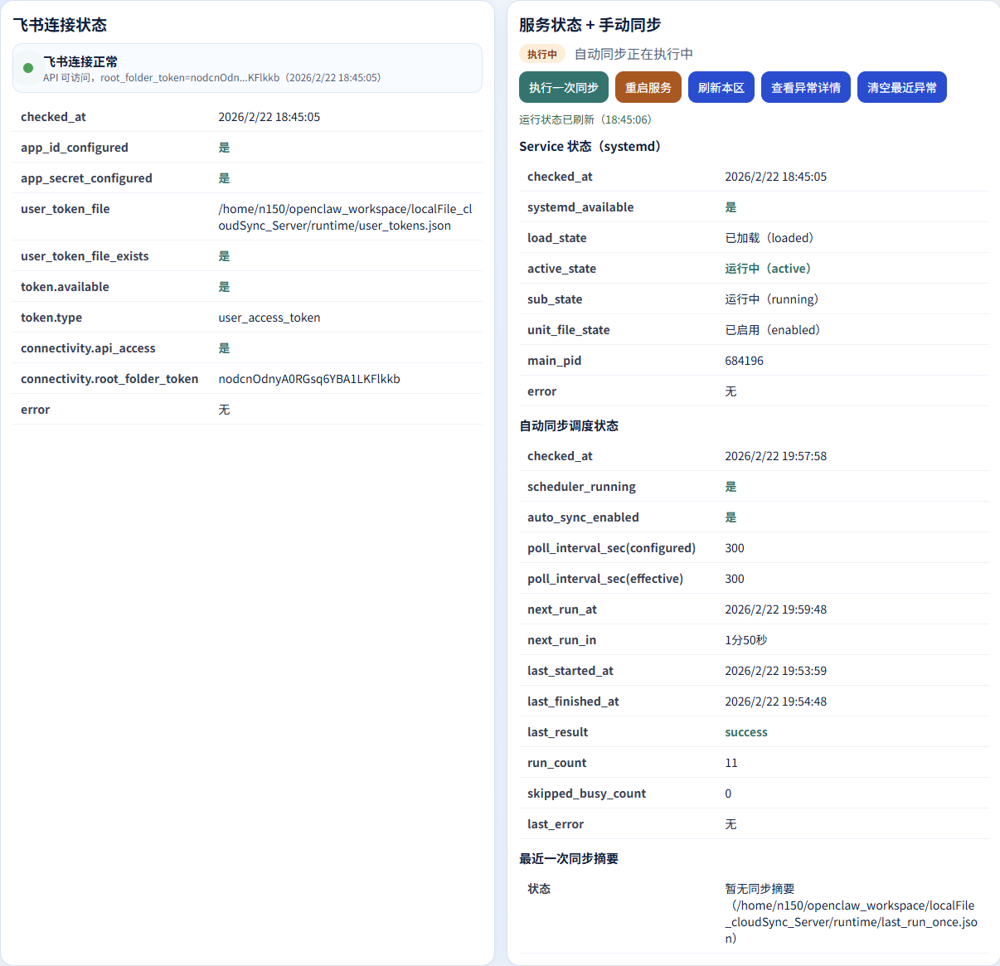
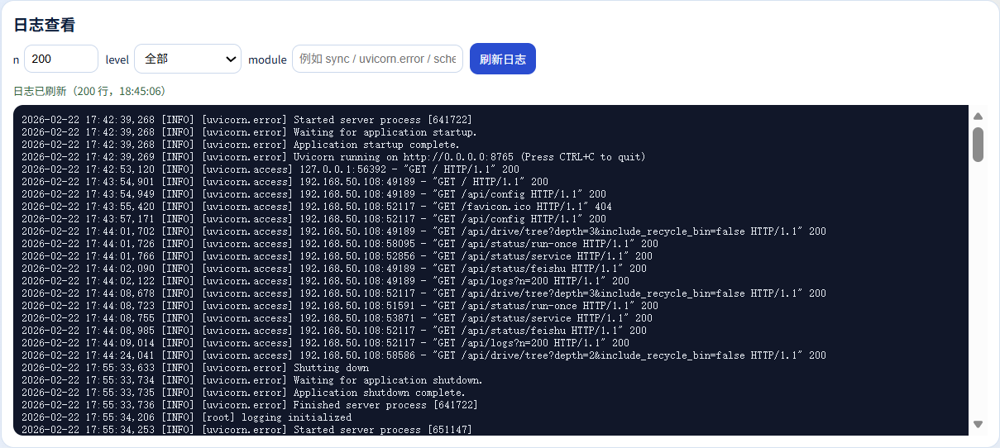

# localFile_cloudSync_Server

本项目是本地目录与飞书 Drive 的同步服务，包含 CLI、Web 控制台、定时调度与 systemd 用户态运行。

## 使用背景

为了实现“本地空间 <-> 飞书云空间”的稳定同步，项目采用以下协作边界：

- OpenClaw 主要操作本地工作空间（文档整理、结构调整、内容生成）。
- 用户主要在飞书云空间操作（协作、分享、在线编辑）。
- 同步服务负责两侧状态对齐，保证最终一致性。
- OpenClaw 不直接操作飞书 OpenAPI，由同步服务统一代理与调度。

这样做的目标：

- 减少不必要的云 API 调用与 token 消耗。
- 将云端鉴权、重试、冲突处理集中到一个服务层，提升稳定性。
- 提高自动化效率：OpenClaw 只关心本地文件任务，云端同步由服务后台完成。

## 目录说明

- 当前实现：`app/`
- 服务单元模板：`deploy/systemd/localfile-cloudsync.service`
- 运维脚本：`scripts/`
- 文档入口：`docs/DOCS_INDEX_ZH.md`

## 快速启动

```bash
cd /home/n150/openclaw_workspace/localFile_cloudSync_Server
source venv/bin/activate
cd app
python -m localfilesync.cli.main --help
python -m localfilesync.web.main
```

## 凭据安全

- `config.yaml` 仅本机使用，已加入 `.gitignore`，不会随 Git 提交。
- 仓库提供示例文件：`config.yaml.example`。
- 若 `config.yaml` 不存在，程序首次加载配置时会自动创建。
- 也可手动初始化（不覆盖已有本机配置）：

```bash
cp -n config.yaml.example config.yaml
```
- 推荐通过 CLI 在本机写入凭据，而不是直接手改并提交：

```bash
python -m localfilesync.cli.main config-set-auth \
  --app-id "<YOUR_APP_ID>" \
  --app-secret "<YOUR_APP_SECRET>" \
  --user-token-file "/home/n150/openclaw_workspace/localFile_cloudSync_Server/runtime/user_tokens.json"
```

- 若历史上曾提交过真实密钥，请立即在飞书开发者后台轮换（撤销旧密钥）。

## 使用环境与依赖

推荐环境：

- OS：Linux（已针对 `systemd --user` 运维方式适配）
- Python：`3.12+`
- Git：`2.43+`（用于发布与版本管理）

核心运行依赖（见 `app/pyproject.toml`）：

- `fastapi`
- `uvicorn`
- `pydantic`
- `pyyaml`
- `requests`
- `typer`
- `rich`

开发依赖：

- `ruff`
- `mypy`
- `pytest`
- `pytest-cov`

安装开发依赖：

```bash
make install
```

## 云空间支持范围（当前版本）

当前仅支持飞书云空间，且仅支持**飞书用户身份链路**：

- `user_access`（即 `user_access_token`）OAuth 授权方案

当前不支持：

- 其他云空间（例如钉钉）
- 非用户身份链路作为主同步模式

## 工程化命令

在仓库根目录执行：

```bash
make install      # 安装开发依赖
make lint         # ruff 检查
make typecheck    # mypy 检查
make test         # pytest
make check        # lint + typecheck + test + compile
make release      # 查看发布脚本用法
make rollback     # 查看回滚脚本用法
```

## 安装部署与开机自启（速查）

完整手册：`docs/DEPLOYMENT_GUIDE_ZH.md`

最短部署路径：

```bash
cd /home/n150/openclaw_workspace/localFile_cloudSync_Server
python3 -m venv venv
source venv/bin/activate
make install
scripts/switch_m1_service.sh prepare
loginctl enable-linger "$USER"
```

## 同步策略（`sync.default_sync_direction`）

可选值：

- `remote_wins`：远端优先。删除/冲突时优先保留云端状态。
- `local_wins`：本地优先。删除/冲突时优先保留本地状态。
- `bidirectional`：双向决策。根据“哪一侧发生变化”自动选择同步方向。

`bidirectional` 的核心行为：

- 仅本地缺失、远端存在：
  - 远端自上次同步后有变化 -> 下载回本地
  - 远端无变化 -> 认为是本地删除，远端移动到回收目录
- 仅远端缺失、本地存在：
  - 本地自上次同步后有变化 -> 上传恢复远端
  - 本地无变化 -> 认为是远端删除，本地移入 `.sync_trash`
- 两侧都变更：按较新的修改时间决策（较新侧胜出）

配置示例：

```yaml
sync:
  default_sync_direction: bidirectional
  initial_sync_strategy: local_wins
```

远端删除与空目录清理（`sync.remote_delete_mode` / `sync.cleanup_empty_remote_dirs`）：

- `remote_delete_mode: recycle_bin`：远端删除改为移动到 `SyncRecycleBin`。
- `remote_delete_mode: hard_delete`：远端删除直接永久删除。
- `cleanup_empty_remote_dirs: true`：每轮同步后清理“本地不存在且已空”的远端目录。
- `cleanup_remote_missing_dirs_recursive: true`：每轮同步后，远端缺失目录可连同内部文件递归删除（高风险，建议谨慎开启）。

示例：

```yaml
sync:
  remote_delete_mode: hard_delete
  cleanup_empty_remote_dirs: true
  cleanup_remote_missing_dirs_recursive: true
```

## 健康检查接口

- `GET /api/healthz`：进程存活检查（liveness）
- `GET /api/readyz`：服务就绪检查（readiness，失败返回 503）

## 界面截图

截图目录：`docs/screenshots/`

### 控制台总览



### 配置区（飞书术语对齐）



### Drive 目录与文件树



### 运行状态与自动同步



### 日志巡检区



截图清单与建议规格：`docs/screenshots/README.md`

## 参考文档

- 文档总览：`docs/DOCS_INDEX_ZH.md`
- 安装部署与开机自启：`docs/DEPLOYMENT_GUIDE_ZH.md`
- 飞书 API 映射：`docs/FEISHU_API_MAPPING_ZH.md`
- OpenClaw 项目记忆：`docs/OPENCLAW_AGENT_MEMORY_ZH.md`
- 工程化路线：`docs/ENGINEERING_ROADMAP_ZH.md`
- 发布手册：`docs/RELEASE_PLAYBOOK_ZH.md`
- 变更模板：`docs/CHANGELOG_TEMPLATE.md`
